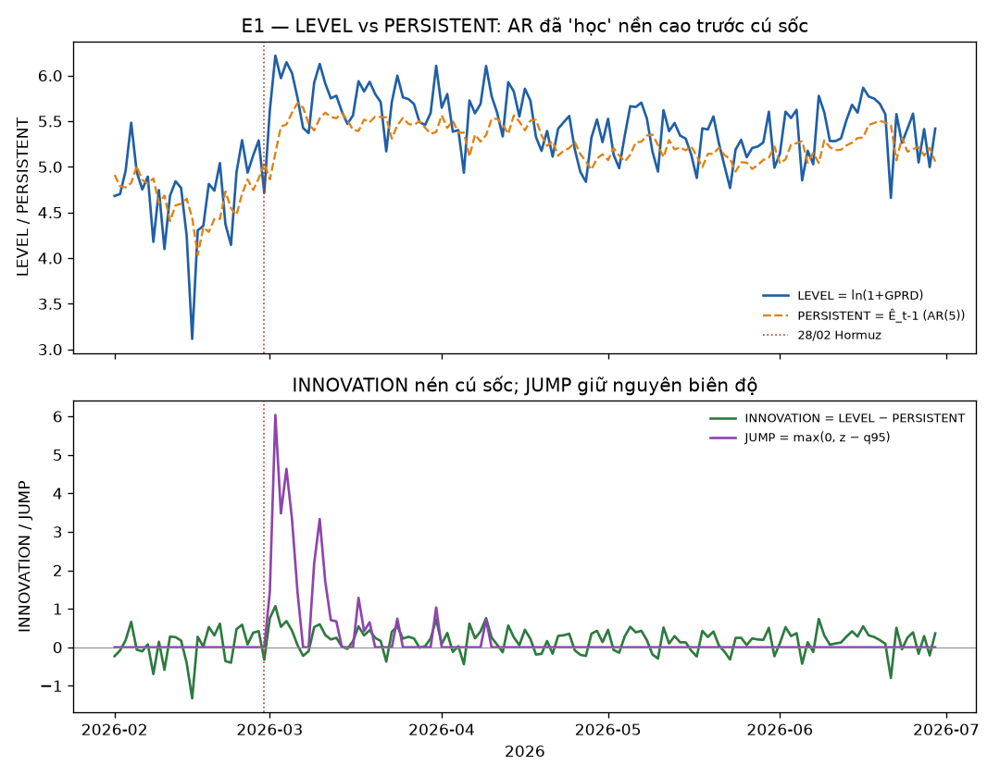

# E1 — Chẩn đoán spec shock quanh Hormuz 2026-02-28

> 🔬 Research diagnostic (docs/11 §10 E1). KHÔNG chạm holdout, không đăng ký giả thuyết. Sinh bởi `scripts/run_e1_diagnosis.py`.

## Metadata

- **data_version** (sha256 GPRD daily): `8cc9bfb5c3b6`
- **git commit**: `dc4c2b2`
- **generated_at**: 2026-07-18T15:38:32
- **AR order (pre-registered, BIC/dev-window)**: p=5
- **cửa sổ**: 2026-02-01 → 2026-06-30

## Sự việc

Cú sốc dầu địa chính trị lớn nhất chuỗi 1985+ (Mỹ/Israel không kích Iran, eo Hormuz đóng cửa thực tế) xảy ra **bên trong mẫu ước lượng G2a** (panel tới 2026-07-02). GPRD daily chạm **500.8** ngày 2026-03-02. Mô hình G2a hiện tại cho γ(oil) ≈ 0.0005 tại h=0, p=0.56. Một mô hình không phát hiện được cú sốc khi nó nằm ngay trong mẫu → vấn đề ở **specification**, không ở thế giới.

## Kết quả decomposition tại đỉnh (2026-03-01..05)

| Đại lượng | Đỉnh | Percentile vs 1990+ |
|---|---|---|
| LEVEL | 6.218 | **99.7** |
| INNOVATION | 1.07 | 99.8 |
| JUMP | 6.032 | **99.9** |

**Biên độ bị nén:** INNOVATION đỉnh = 1.07, trong khi trung bình INNOVATION tuần TRƯỚC sốc (23–27/02) đã là 0.386. Cú sốc lịch sử chỉ cho innovation gấp ~1.8× một ngày thường — vì chuỗi GPRD tăng dần (139→197→138→167→197) trước cú nhảy nên AR(5) đã học nền cao (PERSISTENT leo 4.47→5.04), coi phần lớn cú sốc là 'đã dự báo được'. JUMP giữ nguyên biên độ thật (6.032, percentile 99.9).

## Chẩn đoán (bảng E1 docs/11)

JUMP bật mạnh (biên độ giữ nguyên) trong khi INNOVATION bị nén → **AR(5) khử phần lớn cú sốc** (hàng 1 bảng E1 docs/11). Kết luận: đăng ký giả thuyết mới với JUMP làm shock chính (KĐ-N1).

Đồng thời giải thích bất thường γ(VIX) horizon dài của G2a: nếu shock chính bị nén sai, hệ số ước lượng trên phần residual còn lại không mang ý nghĩa cú sốc — dấu âm ở h dài nhiều khả năng bắt mean-reversion của LEVEL, không phải phản ứng risk-off.

## Hệ quả cho E2–E4

- **E2 (số hạng đuôi):** thêm `JUMP` vào design matrix làm shock chính; test KĐ-N1 (δ_h ≠ 0 trong khi γ_h ≈ 0). Bằng chứng E1 dự đoán δ có ý nghĩa.

- Cần cả LEVEL lẫn JUMP nếu cú sốc dai dẳng (LEVEL cao kéo dài sau khi JUMP tắt — quan sát 06–10/03 LEVEL vẫn ~5.7–6.1).

## Đồ thị

