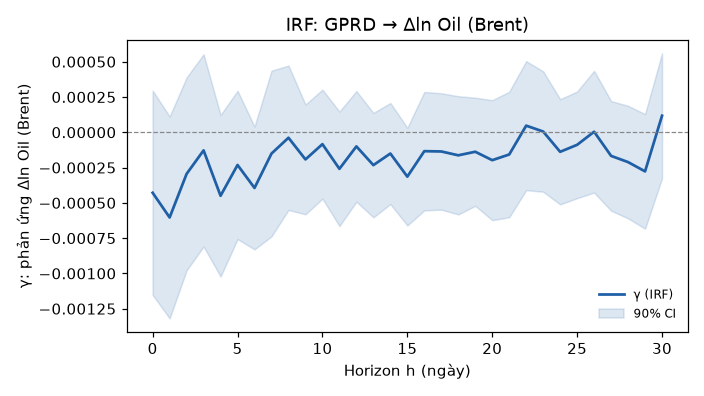
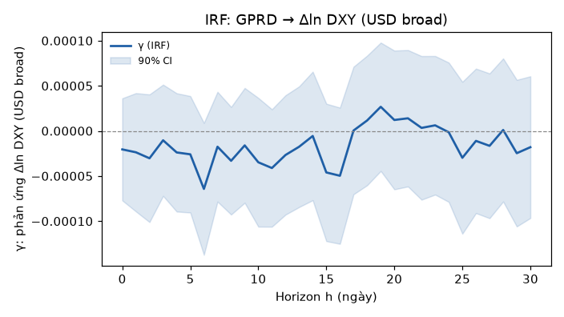
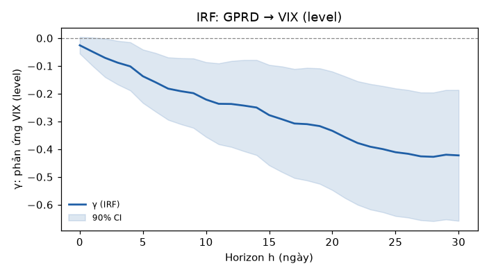
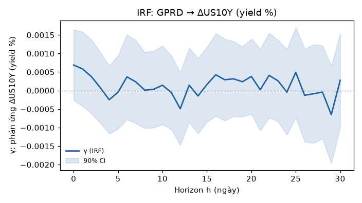

# G2a — Global Macro Impact (Tầng 2 cascade)

> 🔬 Research deliverable. Local Projection (Jordà 2005), docs/07 §3. Sinh tự động bởi `scripts/run_tier2.py`.

> # ⛔ KẾT QUẢ NÀY VÔ HIỆU — KHÔNG TRÍCH DẪN (đánh dấu 2026-07-16)
>
> Report chạy 2026-07-15, TRƯỚC review `docs/08`. Kết luận **NO-GO dưới đây không có hiệu lực** vì dựa trên hai tiền đề mà review đã bác bỏ:
>
> 1. **Shock là LEVEL, không phải innovation** (review §4.4 / CLAUDE.md #9). Hồi quy dùng GPRD chuẩn hóa z-score — vẫn là **mức**, không phải cú sốc. Chuỗi level có autocorrelation cao: phần lớn giá trị hôm nay đã biết từ hôm qua. Với đặc tả đó, "coincident, không leading" gần như là **kết quả mặc định**, không phải phát hiện. Nó KHÔNG chứng minh được innovation không có sức dự báo.
> 2. **Gate "phải đúng dấu kỳ vọng" là confirmation bias** (review §4.6 / `docs/09` §2.5) — tiêu chí này **đã bị bỏ**. Cụ thể: VIX có **29/31 horizon p<0.10** (γ=−0.4276, p=0.002 tại h=28) — tức là tín hiệu MẠNH và ổn định — nhưng bị chấm trượt chỉ vì dấu âm trái kỳ vọng. Dưới gate mới, dấu âm cần **được giải thích**, không phải bị loại: GPRD cao co-move với VIX *đã* cao (đỉnh hoảng loạn), nên phản ứng *tiếp theo* là mean-reversion về phía giảm — hoàn toàn có nghĩa kinh tế, và là một quan sát đáng theo đuổi chứ không phải lỗi.
>
> **Phải chạy lại ở G2a mới** với: shock = `GPR_INNOVATION` (§2.0 file 07 v2), thêm controls Z_t, gate mới 6 tiêu chí. Giữ file này làm **lịch sử/đối chứng** (`docs/09`: "kết quả null/âm vẫn lưu") — nhưng nó là bằng chứng về *level*, không phải về *shock*.
>
> Ghi chú metadata: `data_version` ở đây là sha256 file GPR, chưa theo chuẩn `ext_series.data_version` mới.

## Metadata

- **data_version** (sha256 GPR daily): `8cc9bfb5c3b6`
- **git commit**: `5bd5fcb`
- **generated_at**: 2026-07-15T16:15:24
- **panel range**: 1990-01-03 → 2026-07-02 (9517 ngày giao dịch)
- **macro**: oil, dxy, vix, us10y | **shocks**: GPRD, GPRD_ACT, GPRD_THREAT
- **horizons**: 0..30 ngày | **macro_lags (ρ)**: 5 | HAC/Newey-West SE

## Câu hỏi

"Một cú sốc địa chính trị (GPRD) đẩy dầu / đô / risk-off toàn cầu bao nhiêu?" — deliverable độc lập, country-agnostic. Đây là **INDIRECT channel** (tầng 2) mà mọi nước dùng chung; tầng 3 (params riêng nước) ước lượng sau.

## Cổng G2a: **NO-GO / REVIEW** — ⛔ VÔ HIỆU, xem banner đầu file

**Tiêu chí dưới đây ĐÃ BỊ BỎ** (review `docs/08` §4.6): "γ phải đúng dấu kỳ vọng" là confirmation bias — trade war có thể làm dầu GIẢM do cầu yếu, ép một dấu là sai. Và shock ở đây là **level**, không phải innovation (§4.4). Giữ nguyên văn bản gốc bên dưới để đối chứng lịch sử:

> Tiêu chí (đánh giá **trung thực**): γ phải có ý nghĩa **VÀ đúng dấu kỳ vọng**. γ có ý nghĩa nhưng sai dấu (vd VIX âm) là cảnh báo co-move ngược / lỗi spec — KHÔNG tính là pass. Shock chính `GPRD` (đã chuẩn hóa z-score):

- **Δln Oil (Brent)**: không horizon nào p<0.10 → không có phản ứng rõ. Kỳ vọng: dương (shock đẩy giá dầu lên — kênh energy, Caldara-Iacoviello).
- **Δln DXY (USD broad)**: không horizon nào p<0.10 → không có phản ứng rõ. Kỳ vọng: dương (flight-to-safety vào USD).
- **VIX (level)**: 29/31 horizon p<0.10; đỉnh |γ| tại h=28 (γ=-0.4276, p=0.002) — ⚠ **SAI DẤU so với kỳ vọng** (co-move ngược / spec). Kỳ vọng: dương (risk-off, biến động tăng).
- **ΔUS10Y (yield %)**: không horizon nào p<0.10 → không có phản ứng rõ. Kỳ vọng: âm/mơ hồ (flight-to-quality kéo yield xuống, nhưng lạm phát dầu đẩy lên).

## Bảng IRF (γ) — shock `GPRD`

γ = impulse response: phản ứng biến vĩ mô tại h ngày sau shock **+1 độ lệch chuẩn** GPRD (chuẩn hóa, không log1p — xem ghi chú biến đổi). **β_std** = γ/std(macro) → 'số σ macro phản ứng trên 1σ shock', so sánh được giữa các kênh (β_std≈0 cho DXY/oil là thật, không phải lỗi). **In đậm** = p<0.10.

| Macro | h | γ (beta) | β_std (σ/σ) | SE | p-value | 90% CI |
|---|---|---|---|---|---|---|
| Δln Oil (Brent) | 0 | -0.0004 | -0.017 | 0.0004 | 0.330 | [-0.0012, 0.0003] |
| Δln Oil (Brent) | 1 | -0.0006 | -0.023 | 0.0004 | 0.165 | [-0.0013, 0.0001] |
| Δln Oil (Brent) | 5 | -0.0002 | -0.009 | 0.0003 | 0.468 | [-0.0008, 0.0003] |
| Δln Oil (Brent) | 10 | -0.0001 | -0.003 | 0.0002 | 0.720 | [-0.0005, 0.0003] |
| Δln Oil (Brent) | 20 | -0.0002 | -0.008 | 0.0003 | 0.445 | [-0.0006, 0.0002] |
| Δln Oil (Brent) | 30 | 0.0001 | +0.005 | 0.0003 | 0.663 | [-0.0003, 0.0006] |
| Δln DXY (USD broad) | 0 | -0.0000 | -0.006 | 0.0000 | 0.551 | [-0.0001, 0.0000] |
| Δln DXY (USD broad) | 1 | -0.0000 | -0.006 | 0.0000 | 0.552 | [-0.0001, 0.0000] |
| Δln DXY (USD broad) | 5 | -0.0000 | -0.007 | 0.0000 | 0.508 | [-0.0001, 0.0000] |
| Δln DXY (USD broad) | 10 | -0.0000 | -0.009 | 0.0000 | 0.422 | [-0.0001, 0.0000] |
| Δln DXY (USD broad) | 20 | 0.0000 | +0.003 | 0.0000 | 0.796 | [-0.0001, 0.0001] |
| Δln DXY (USD broad) | 30 | -0.0000 | -0.005 | 0.0000 | 0.705 | [-0.0001, 0.0001] |
| VIX (level) | 0 | -0.0258 | -0.003 | 0.0182 | 0.157 | [-0.0558, 0.0042] |
| VIX (level) | 1 | -0.0486 | -0.006 | 0.0309 | 0.115 | [-0.0995, 0.0022] |
| VIX (level) | 5 | **-0.1374** | -0.018 | 0.0585 | 0.019 | [-0.2335, -0.0412] |
| VIX (level) | 10 | **-0.2213** | -0.029 | 0.0819 | 0.007 | [-0.3559, -0.0866] |
| VIX (level) | 20 | **-0.3339** | -0.043 | 0.1298 | 0.010 | [-0.5474, -0.1204] |
| VIX (level) | 30 | **-0.4224** | -0.055 | 0.1434 | 0.003 | [-0.6583, -0.1866] |
| ΔUS10Y (yield %) | 0 | 0.0007 | +0.012 | 0.0006 | 0.236 | [-0.0003, 0.0016] |
| ΔUS10Y (yield %) | 1 | 0.0006 | +0.010 | 0.0006 | 0.338 | [-0.0004, 0.0016] |
| ΔUS10Y (yield %) | 5 | -0.0000 | -0.001 | 0.0006 | 0.939 | [-0.0010, 0.0009] |
| ΔUS10Y (yield %) | 10 | 0.0001 | +0.003 | 0.0006 | 0.824 | [-0.0009, 0.0012] |
| ΔUS10Y (yield %) | 20 | 0.0004 | +0.007 | 0.0006 | 0.537 | [-0.0006, 0.0014] |
| ΔUS10Y (yield %) | 30 | 0.0003 | +0.005 | 0.0008 | 0.722 | [-0.0010, 0.0015] |

## Đồ thị IRF

### Δln Oil (Brent)

### Δln DXY (USD broad)

### VIX (level)

### ΔUS10Y (yield %)

## KĐ3 — Threat vs Act (β_std theo nhiều horizon)

β_std = γ/std(macro) cho GPRD_THREAT vs GPRD_ACT — act có **mạnh & trễ hơn** threat không? Câu hỏi global thuần túy. `*` = p<0.10.

| Macro | shock | h=0 | h=1 | h=5 | h=10 | h=20 |
|---|---|---|---|---|---|---|
| Δln Oil (Brent) | THREAT | -0.008 | -0.015 | -0.004 | -0.010 | -0.002 |
| Δln Oil (Brent) | ACT | -0.020 | -0.026* | -0.010 | +0.001 | -0.010 |
| Δln DXY (USD broad) | THREAT | -0.003 | -0.004 | -0.013 | -0.013 | +0.000 |
| Δln DXY (USD broad) | ACT | -0.006 | -0.005 | -0.003 | -0.004 | +0.004 |
| VIX (level) | THREAT | -0.004* | -0.006* | -0.017* | -0.025* | -0.038* |
| VIX (level) | ACT | -0.002 | -0.005 | -0.014* | -0.024* | -0.036* |
| ΔUS10Y (yield %) | THREAT | +0.013 | +0.006 | +0.004 | +0.005 | +0.008 |
| ΔUS10Y (yield %) | ACT | +0.008 | +0.011 | -0.004 | -0.004 | +0.006 |

## Robustness — dấu γ(VIX) qua sub-sample

β_std VIX theo GPRD trên các giai đoạn. Nếu dấu âm ổn định qua mọi sub-sample → không phải artifact của 1 giai đoạn (vd khủng hoảng 2008), củng cố kết luận GPRD coincident/lagging. `*` = p<0.10.

| Sub-sample | n | h=1 | h=5 | h=10 |
|---|---|---|---|---|
| full | 9517 | -0.006 | -0.018* | -0.029* |
| pre-2008 | 4691 | -0.005 | -0.017* | -0.030* |
| post-2008 | 4826 | -0.012 | -0.027* | -0.040* |
| post-2015 | 3000 | -0.007 | -0.015 | -0.024 |

## Ghi chú biến đổi & nhận diện (đọc kỹ)

- **Shock chuẩn hóa, KHÔNG log1p.** docs/07 §0 bắt buộc log(1+GPR) vì phân phối *country-GPR nước nhỏ* (mean/std ≈ 0.05, lệch phải). GPRD **toàn cầu daily** (~10..370) không thuộc phân phối đó; log1p ép 370→5.9, làm phẳng spike khủng hoảng. Nên dùng z-score → γ đọc là 'phản ứng / 1σ shock'. Quy ước log1p vẫn giữ cho country-GPR ở tầng 3.
- **Panel lưới business-day liên tục + complete-case một lần** (data_files.build_tier2_panel): tránh lỗi trước đây khi NaN rải rác khiến mỗi horizon chạy trên mẫu khác nhau và AR-lag nhảy qua khe NaN (gây γ VIX âm giả). Nay mọi horizon dùng cùng mẫu.
- **DXY nối dài**: DTWEXM (major, 1973→2019) nối DTWEXBGS (broad, 2006→) ở cấp return Δln (overlap 2006–2019 corr=0.926). Nhờ vậy có đủ 4 kênh macro 1990+ thay vì chỉ 2006+ (broad-only).

## Giới hạn & bước sau

- **GPR là coincident, chưa thấy leading**: γ đương thời (h=0) yếu; VIX tương lai có xu hướng *mean-revert* sau spike GPRD (γ âm ở h dài) — GPRD hay xảy ra *tại* đỉnh biến động, không dẫn trước. Đây là dữ kiện quan trọng cho KĐ5 (lead-lag) ở G2b, không phải lỗi.
- Chưa orthogonalize giữa các shock (GPRD chứa cả threat+act); mediation đầy đủ chờ tầng 3 (G2b).
- Chưa tách theo `channel` (energy/trade) — cần S-GPR (G5). Khi có, chạy lại theo channel để xác nhận energy→γ_oil cao.
- **Tiếp theo**: dù cổng ra sao, G2a là deliverable độc lập. G2b `tier3_country.py` + `config/params/vn.yaml` (mediation Direct/Indirect cho VN-Index) là bước kế.
